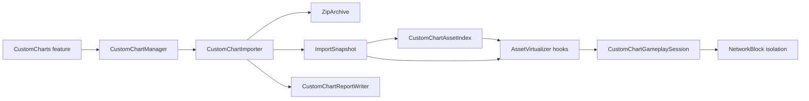

# Custom Chart Importer

## Module boundaries

The feature lifecycle stays in `src/features/CustomCharts.*`. It owns
configuration and hook installation only. Import and runtime asset behavior
are behind the manager seam:

`CustomChartImporter` owns `.arcpkg` and raw ZIP parsing, bounded metadata
conversion, content-addressed cache extraction, and import diagnostics. It
does not publish runtime state. The importer returns a C++23
`std::expected<ImportSnapshot, std::string>`.

`CustomChartAssetIndex` owns logical-to-source paths and all APK-era aliases
(`Resources/`, `assets/`, `file:///android_asset/`, and `1080` jacket aliases).
`Resolve`, directory listing, and custom-chart detection use the same
canonicalization function, so hook callers cannot disagree about an alias.

`CustomChartGameplaySession` is the small atomic window used by NetworkBlock
isolation. `OpenHook` starts it only after `IsCustomChartPath` accepts a mapped
`.aff`. A later `AAsset_read` whose path ends with `kJacketAssetName`
(`base.jpg`) ends it.

`CustomChartReportWriter` is the commit gate for the `manifest.json` and
`import-report.json` pair. Any staging or replacement failure restores the
previous pair and returns an error. Orphan cache removal runs afterward as
best-effort garbage collection: stale files do not affect snapshot correctness,
and a cleanup failure must not invalidate the newly committed snapshot.

## Runtime invariants

- A published snapshot is read-only from feature and hook code.
- Duplicate song IDs or logical asset paths reject the new import instead of
  silently overwriting an existing song.
- Byte-identical packages are deduplicated by content hash and reported as a
  skipped package instead of creating colliding song IDs.
- Metadata entry sizes are rejected from ZIP metadata before inflation, so
  text parsing never allocates the archive-wide extraction limit.
- A missing custom background falls back to `base_light` or `base_conflict`
  and emits a `DEFAULTED_FIELD` diagnostic.
- Raw packages never borrow chart, audio, jacket, or background files from a
  different directory prefix.
- Song-list merging is a pure snapshot operation; index allocation checks
  `INT64_MAX` before incrementing and does not perform hook-thread disk I/O.
- Failed imports leave `imported_` false, so the next initialization attempt
  can retry without exposing a partial snapshot.
- Manifest and report files are staged and backed up as one publish operation;
  ordinary filesystem failures restore the previous pair. Process termination
  between the two final renames remains a filesystem crash-consistency bound.

## Verification

- `python tests/run_host_tests.py`
- `python tests/verify_profile.py`
- `./build.ps1 --rebuild --rel`

The host importer fixtures cover Beyond/Eternal slots, malformed metadata
fallback, bounded numeric fields, missing-background fallback, alias lookup,
multi-directory raw ZIPs, report generation, and orphan-cache cleanup.
They also cover duplicate package content, pre-inflate metadata limits,
temporary filesystem failure and retry, and canonical directory aliases.
