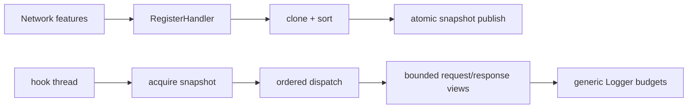

# Network Handler Snapshot

`NetworkManager` remains the runtime facade. Handler registration is a
clone-on-write operation: it copies the current `HandlerSnapshot`, inserts the
new immutable entry, sorts by priority and registration order, then publishes
the new `shared_ptr` through the standard atomic shared-pointer free functions
with release semantics. Hook dispatch acquires one
snapshot and iterates that stable view, so a registration retry cannot resize
or reorder a vector while a hook is using it.

## Runtime invariants

- A published handler entry owns its name; caller string lifetime does not
  escape registration.
- Dispatch sees one immutable handler order for the whole request phase.
- Sequence numbers are atomic and skip zero, which remains the invalid value
  used by the logger.
- Network body extraction is capped at
  `cfg::network_block::kNetworkBodyCaptureMax` (1024 bytes) before mapping
  checks and escaping. `BufferView` preserves `full_len`, `show_len`, status,
  and an explicit `Truncated()` predicate.
- NetworkLogger may apply a smaller configured budget, while the common logger
  still controls the final logcat/file sink limits.
- Runtime object addresses and curl error buffers are private to the manager;
  handlers receive copied error text and borrowed bounded views instead.
- NetworkBlock's count and first-activation flag are atomic across hook
  threads.
- Curl state binds to the first handle observed inside one process-request
  hook, ignores interleaved options from another handle, and restores an outer
  thread-local context after nested requests. Cross-thread handle transfer is
  not modeled and remains an explicit runtime assumption.

The snapshot is intentionally built by the existing registration API. A
separate builder/commit protocol would add a second lifecycle without removing
the hook transaction seam; the clone-on-write snapshot gives the hook thread
the needed locality while preserving retry behavior for late profile
resolution.

## Verification

`tests/host_tests.cpp` checks priority ordering, stable registration order,
snapshot immutability, duplicate lookup, and body-view truncation. The complete
host suite and NDK release build are the acceptance checks because the hook
implementation itself is Android-only.
